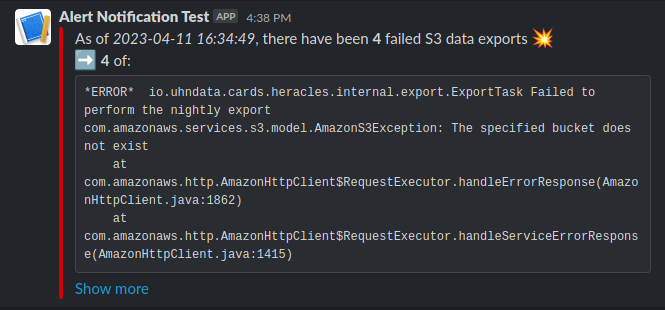
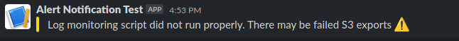

# cards-log-monitor

Tools for using Grafana, Loki, and Promtail for monitoring the logs of a
running CARDS instance and sending alerts to a Slack webhook

### Usage

In order to use this log monitor, log entries in Loki from the monitored
CARDS container _must_ contain the `name` field identifying the
container which they originate from. This can be done by using the
provided `promtail-config.yaml` file and adding a configuration such as

```yaml
logging:
  driver: "json-file"
  options:
    labels: "containerPrettyName"
labels:
  containerPrettyName: "CARDS - Heracles"
```

to the CARDS container (usually `cardsinitial`) in its own
`docker-compose.yml` file.

Once this has been configured, a Promtail / Loki / Grafana stack can be
started by running `docker-compose up -d`. The Grafana web interface
will be available at http://localhost:3000 and the Loki REST API will be
available at http://localhost:3100.

#### `generate_alerts/generate_alerts.py`

The `generate_alerts.py` Python script, when executed, queries the
configured Loki REST API (default is `http://localhost:3100`) to see if
any alerts should be raised. If an alert is raised, and the
`SLACK_WEBHOOK_URL` environment variable is set, the alert will be sent
to the configured Slack webhook thus displaying the alert in a Slack
workspace. Alerts will be generated if:
  - For the container specified by the `MONITORED_CONTAINER_PRETTY_NAME` environment variable
  - The error message text specified by the `ERROR_LOG_TEXT` environment variable is present in any log line
  - And such happens after the greater of:
    - The time of the last recorded fix in `manual_fixes.log`
    - The recorded time of the last execution of `generate_alerts.py` that did not raise any alerts

The `generate_alerts.py` Python script will, thus, send to Slack _one_
of the following _three_ types of alerts:

1. **Success**: `generate_alerts.py` can confirm that there are no unresolved alerts to be dealt with.


2. **Alert(s)**: `generate_alerts.py` can confirm that they are unresolved alerts to be dealt with.



3. **Inconclusive**: `generate_alerts.py` did not run sucessfully and cannot confirm if there are or are not any alerts to be dealt with.


